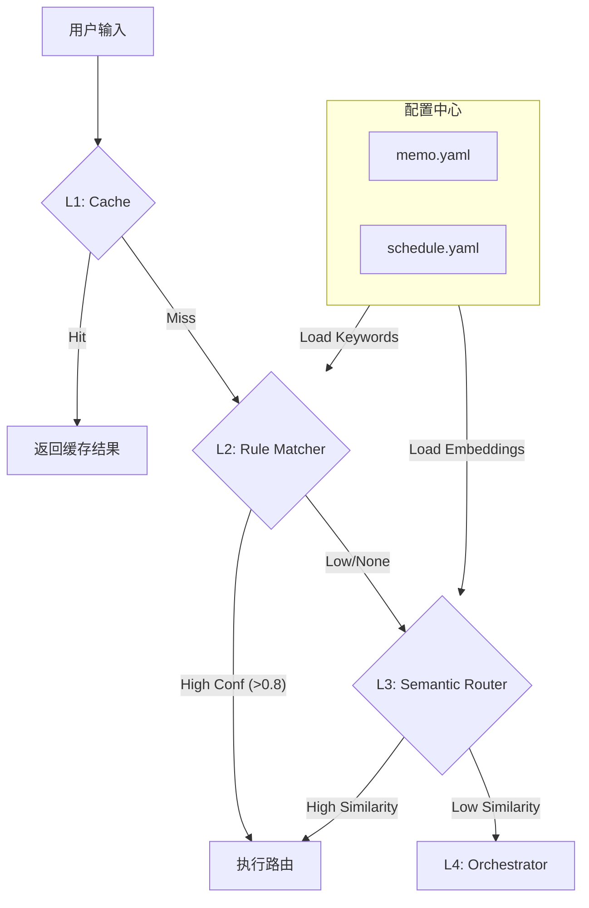

# 路由系统重构调研报告

> 调研时间: 2026-02-16 | 版本: v1.1 | 状态: 方案评审中

## 1. 现状深入分析

### 1.1 核心痛点

在 E2E 测试与日常使用中，路由系统暴露了**准确性**与**扩展性**的双重问题：

1.  **误路由 (False Positive)**: 用户输入 "查看今天的笔记"，被错误路由到 `SCHEDULE` (置信度 0.85)。
2.  **Handoff 失败**: Agent 尝试转交任务时，因目标名称验证失败而中断。
3.  **配置割裂**: 路由规则硬编码在 Go 代码中，与 YAML 里的 Agent 定义脱节。

### 1.2 代码级根因分析

#### 问题 A: RuleMatcher 的 "Fast Path" 逻辑缺陷
**位置**: `ai/routing/rule_matcher.go:465-468`

```go
// FAST PATH: Time pattern + query pattern → schedule query
if m.hasTimePattern(input) && queryPatternRegex.MatchString(lower) && !m.hasMemoKeyword(input) {
    return IntentScheduleQuery, 0.85, true
}
```

*   **缺陷**: 这是一个硬编码的启发式规则。
    *   "查看" (Query Pattern) + "今天" (Time Pattern) 命中规则。
    *   `!m.hasMemoKeyword(input)` 判断失效。原因是 `capabilityMap` 目前匹配的是*能力描述*而非*触发词*，且缺乏明确的 Keyword-to-Agent 映射。
    *   **后果**: 任何带有时间词的查询，只要没命中那一小撮硬编码的 Memo 关键词，都会被强行劫持到日程 Agent。

#### 问题 B: Handoff 身份验证过于严格
**位置**: `ai/agents/tools/report_inability.go:12-15`

```go
var ValidExpertAgents = map[string]bool{
    "memo":     true,
    "schedule": true,
}
```

*   **缺陷**: 白名单硬编码且仅支持 ID。
    *   LLM (基于语义理解) 倾向于使用自然语言名称（如 "笔记搜索专家"）。
    *   工具层缺乏 ID 归一化 (Normalization) 机制。
    *   **后果**: 有效的协作请求被系统拦截，导致流程中断。

---

## 2. 行业最佳实践调研

针对 LLM 应用的路由（Routing）与网关（Gateway）架构，调研了业界主流方案（LobeChat, LangChain, Semantic Router, Traefik AI等），总结出以下最佳实践：

### 2.1 路由分层架构 (Layered Routing)

最稳健的架构通常采用 **"漏斗型" (Funnel)** 设计，由快到慢，由粗到细：

1.  **Layer 1: Exact/Cache (0ms)**
    *   精确匹配历史问答或高频指令。
    *   利用 LRU Cache 或 Semantic Cache。
2.  **Layer 2: Rule/Keyword (1ms)**
    *   基于正则 (Regex) 和关键词 (Keyword) 的快速分类。
    *   **关键点**: 配置必须与 Agent 定义绑定，而非写死在代码里。
3.  **Layer 3: Semantic (50ms)**
    *   **当前系统缺失层**。
    *   利用轻量级 Embedding (如 `bge-m3` 或更小的模型) 计算 Query 与 Agent 核心能力的余弦相似度。
    *   解决 "语义相关但无关键词" 的长尾问题。
4.  **Layer 4: LLM Handler (1s+)**
    *   Orchestrator / Router Agent。
    *   处理复杂、多意图或模棱两可的请求。

### 2.2 配置驱动 (Configuration Driven)

*   **Single Source of Truth**: Agent 的属性（名称、能力、路由规则）应统一在配置文件中定义。
*   **热加载**: 支持运行时更新路由表，无需重新编译。

---

## 3. 重构方案设计

目标：构建一个**零硬编码、配置驱动、支持语义路由**的智能分发系统。

### 3.1 架构图



### 3.2 核心数据结构变更

在 `config/parrots/*.yaml` 中新增 `routing` 字段，不仅定义关键词，还引入语义示例。

#### YAML 配置示例 (memo.yaml)

```yaml
name: memo
# ... 原有配置 ...

# 新增路由配置
routing:
  # 1. 规则匹配 (Layer 2)
  keywords:
    - "笔记"
    - "memo"
    - "记录"
    - "文章"
  patterns:
    - "查看.*笔记"
    - "搜索.*内容"
  
  # 2. 语义匹配 (Layer 3)
  # 这里的句子会被预计算为 Embedding 向量
  semantic_examples:
    - "我之前好像记过关于数据库的配置"
    - "帮我找一下上周的会议记录"
    - "知识库里有没有关于 Golang 的文章"
    
  # 3. 排除规则 (Negative Routing)
  # 明确不属于该 Agent 的情况
  excludes:
    - "创建日程"
```

### 3.3 组件改造计划

1.  **AgentRegistry (增强)**:
    *   解析 YAML 中的 `routing` 字段。
    *   构建内存中的 `KeywordIndex` (倒排索引)。
    *   构建内存中的 `SemanticIndex` (向量索引，使用现有 `ai/embedding` 能力)。

2.  **RuleMatcher (重构)**:
    *   移除 `MatchWithUser` 中所有硬编码的 `if schedule` 逻辑。
    *   改为通用逻辑：`Score = BaseWeight + KeywordMatch + PatternMatch`。
    *   时间词 (Time Pattern) 降级为 "通用特征"，不再作为 Schedule 的独占触发器，除非配合 Schedule 的特定关键词。

3.  **HandoffHandler (修复)**:
    *   `ValidExpertAgents` 不再硬编码。
    *   改为调用 `AgentRegistry.IdentifyAgent(name)`。
    *   支持模糊匹配 (Fuzzy Match): mapping `笔记专家` -> `memo`。

## 4. 实施路线图

### Phase 1: 基础重构 (本次目标)
- [ ] 定义 `config` 中的 Routing Schema。
- [ ] 改造 `AgentRegistry` 以加载新配置。
- [ ] 彻底重写 `RuleMatcher`，移除 `ai/routing` 中的业务硬编码。
- [ ] 修复 `report_inability` 的校验逻辑。

### Phase 2: 语义增强 (后续规划)
- [ ] 引入 `SemanticRouter`，在 Rule 匹配失败时启用向量匹配。
- [ ] 实现基于用户反馈的路由权重自学习 (RLHF-lite)。

## 5. 验收标准

1.  **Bad Case 修复**: "查看今天的笔记" 必须 100% 路由至 `memo` 或 `orchestrator`，绝不能是 `schedule`。
2.  **Handoff 通路**: 模拟 LLM 返回 "笔记助手" 时，系统能自动纠正为 "memo" 并成功转交。
## 6. 详细设计与风险评估

### 6.1 数据结构定义 (Draft)

在 `ai/agents/registry` 或 `ai/config` 中定义：

```go
type RoutingConfig struct {
    Keywords []string `yaml:"keywords"` // 精确关键词
    Patterns []string `yaml:"patterns"` // 正则表达式
    
    // 语义路由示例 (Layer 3)
    SemanticExamples []string `yaml:"semantic_examples"`
    
    // 权重配置 (可选，默认值为 1)
    Weight int `yaml:"weight"`
}
```

### 6.2 风险与缓解

| 风险点         | 影响                                          | 缓解策略                                                                        |
| -------------- | --------------------------------------------- | ------------------------------------------------------------------------------- |
| **冷启动延迟** | 语义路由需要加载 Embeddings，首次启动可能较慢 | 在服务启动时异步预加载 Embedding 缓存                                           |
| **API 依赖**   | Embedding API 故障导致路由降级                | 增加 Circuit Breaker，失败时回退到 Rule Matcher 或直接转给 Orchestrator         |
| **配置错误**   | 用户编写了错误的正则导致 Panic                | 在 `configloader` 阶段进行 `regexp.Compile` 预校验，错误则忽略该规则并 Log Warn |

### 6.3 兼容性策略

为保证平滑过渡，Phase 1 阶段将保留 `RuleMatcher` 的部分兜底逻辑，直到所有 Agent 的 YAML 都完成了通过 CI/CD 的验证。

