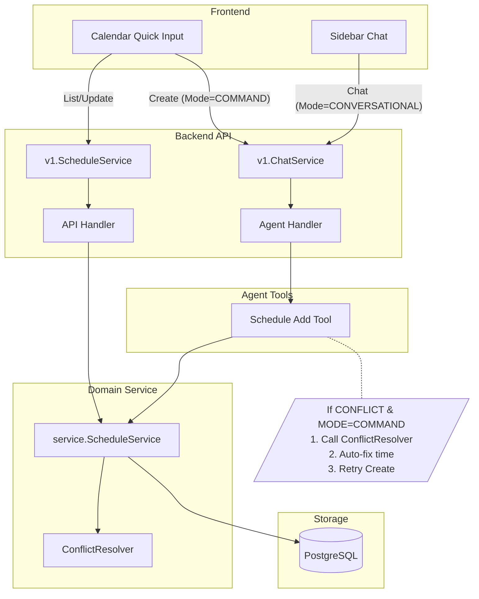

# 日程管理系统重构方案 (Schedule System Refactoring Plan)

## 1. 背景与目标 (Background & Goals)

### 1.1 当前痛点
*   **逻辑割裂**: API 层 (GUI调用) 和 Agent 层 (Chat调用) 使用两套独立的日程管理逻辑。API 层缺乏高级冲突检测和 RRule 处理能力。
*   **交互冗余**: Calendar Quick Input 组件调用了全功能 Chat Agent，导致用户只想快速加个日程，却要忍受 Agent 的寒暄和低效的多轮对话。
*   **冲突处理体验差**: 遇到时间冲突时，用户只能通过自然语言与 Agent 协商，无法直观选择可用时间段。

### 1.2 重构目标
1.  **统一大脑 (Unified Logic)**: API 和 Agent 必须共用 `service.ScheduleService` 作为唯一的业务逻辑入口，确保冲突检测和 RRule 行为一致。
2.  **双模交互 (Dual-Mode Interaction)**:
    *   **Chat 模式**: 保持原有对话体验，支持多轮交互和上下文记忆。
    *   **Command 模式**: 专为 Calendar Quick Input 设计，追求极致效率。
        *   **静默执行**: 不返回废话。
        *   **智能规避**: 遇到冲突时，**自动寻找**最近的可用时间段并创建，而非报错等待用户处理（除非无法自动解决）。
3.  **UI 赋能 (UI Empowerment)**: 利用 Service 层返回的结构化冲突数据，在前端提供“一键解决冲突”的图形化界面（作为自动规避失败的兜底）。

## 2. 总体架构设计 (Architecture Design)



## 3. 详细设计方案 (Detailed Design)

### 3.1 后端：API 层逻辑下沉
**现状**: `server/router/api/v1/schedule_service.go` 包含大量重复的冲突检测代码。
**变更**:
*   移除 API 层所有业务逻辑（冲突检测、时间重叠判断、重复规则展开）。
*   API 层全面委托给 `service/schedule` 包。
*   **关键点**: Service 层返回的 `ConflictError` 包含 `Alternatives` (替代时间方案)，API 层需将其序列化为 gRPC Error Details 或特定的响应结构，供前端使用。

```go
// 伪代码示例：API 层改造
func (s *ScheduleService) CreateSchedule(ctx, req) {
    // 直接调用 Domain Service
    created, err := s.service.CreateSchedule(ctx, userID, req)
    if err != nil {
        if conflictErr, ok := err.(*schedule.ConflictError); ok {
            // 将结构化冲突信息返回给前端
            return status.New(codes.AlreadyExists, "conflict").WithDetails(conflictErr).Err()
        }
        return err
    }
    return toProto(created)
}
```

### 3.2 Agent：交互模式 (Interaction Mode)
**现状**: Agent 只有一种“唠叨”模式。
**变更**:
1.  **协议扩展**: 在 `ChatRequest` 中增加 `InteractionMode`。
    ```protobuf
    enum InteractionMode {
      MODE_CONVERSATIONAL = 0; // 默认：对话模式
      MODE_COMMAND = 1;        // 新增：指令模式 (静默执行 + 自动规避)
    }
    
    message ChatRequest {
      // ...
      InteractionMode mode = 10;
    }
    ```
2.  **Tool 增强 (Smart Resolve)**:
    *   在 `schedule_add` 工具内部检测 `ctx` 中的 Mode。
    *   **IF Mode == COMMAND**:
        *   调用 Service 创建日程。
        *   **IF Conflict**:
            *   调用 `ConflictResolver` 寻找替代方案。
            *   若找到可用方案（e.g., 延后30分钟），**自动使用新时间重试创建**。
            *   返回结果：`"Success: Created at 15:30 (Auto-adjusted from 15:00 due to conflict)"`。
    *   **IF Mode == CONVERSATIONAL**:
        *   返回冲突错误，交由 Agent 进行多轮对话协商。

### 3.3 会话持久化策略
考虑到 `/schedule` 入口主要用于快速操作，其会话生命周期与 `/chat` 不同：
*   **/chat (Conversational Mode)**:
    *   **持久化**: 是。历史记录保存到数据库，支持长期记忆。
    *   **上下文**: 包含完整的对话历史。
*   **/schedule (Command Mode)**:
    *   **持久化**: **否**。会话仅在操作期间（如处理冲突的多轮交互）保持在内存/缓存中。一旦操作完成或超时，即销毁。
    *   **上下文**: 短期上下文，专注当前任务。

### 3.4 冲突处理 UI 交互 (兜底策略)
如果自动规避失败（例如当天全满），则回退到 UI 交互：
1.  **后端**: Agent (Command Mode) 尝试自动解决失败 -> 返回 `ConflictError` (含替代方案)。
2.  **Agent**: 将 `ConflictError` 透传给前端 (JSON 格式)。
3.  **前端**:
    *   识别到 Conflict JSON。
    *   **不展示文本气泡**。
    *   直接弹窗显示 "无法自动安排：时间冲突"，并列出 Service 推荐的替代时间段。
4.  **解决**: 用户点击其中一个时间段 -> 前端发送确认指令 -> 日程创建成功。

## 4. 实施计划 (Implementation Steps)

### Phase 1: Service 层收拢 (Backend Refactoring)
*   [ ] 完善 `service/schedule`：确保 `CreateSchedule`, `UpdateSchedule` 覆盖 API 层所需的所有逻辑。
*   [ ] 重构 `api/v1/schedule_service.go`：删除冗余代码，对接 Service 接口。
*   [ ] 验证：确保 API 接口的冲突检测行为与 Agent 一致。

### Phase 2: Agent 模式支持 & 智能工具 (Smart Tools)
*   [ ] 更新 Proto 定义：添加 `InteractionMode`。
*   [ ] 更新 `schedule_add` 工具：增加 Command Mode 下的自动冲突规避逻辑。
*   [ ] 更新 `UniversalParrot`：支持根据 Mode 动态调整 System Prompt。

### Phase 3: 前端适配 (Frontend & Interaction)
*   [ ] 更新 Calendar Quick Input 组件：调用 Chat 接口时带上 `MODE_COMMAND`。
*   [ ] 开发冲突解决 UI：解析结构化错误并展示（作为自动规避的兜底）。

## 5. 风险控制
*   **兼容性**: Proto 变更需确保前后端版本同步，或做好向后兼容。
*   **用户习惯**: 自动调整时间可能会导致用户困惑，必须在 UI 上清晰提示（例如 Toast 或高亮提醒）"已自动调整到 15:30"。
