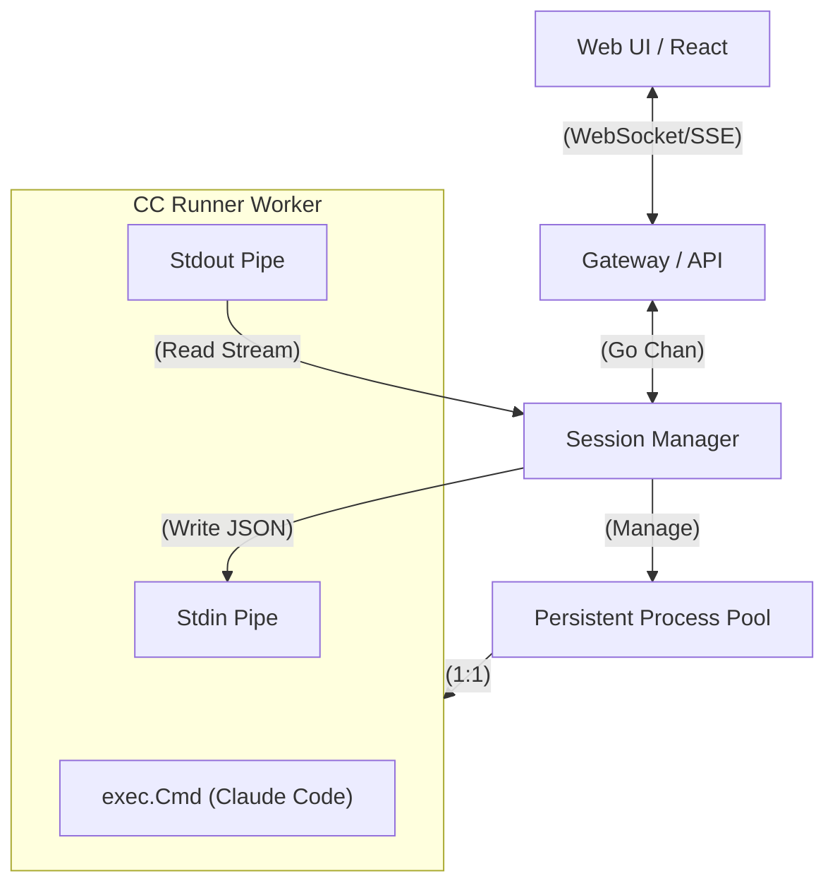

# Research: CC Runner 异步交互架构升级调研

## 1. 概述 (Overview)
目前的 `cc_runner` 实现采用"一次性"（One-shot）执行模型，类似于 HTTP 短连接，每次请求启动新进程。这种方式不仅资源开销大，更阻碍了 **Geek Parrot** 发挥其实际能力（实时交互、确认操作、多步调试）。

本研究旨在结合我们对 **Claude Code CLI** 在 **输出解析**（早期调研）和 **输入注入**（近期调研）的两方面发现，设计一套完整的**全双工异步架构**。

## 2. 核心能力挖掘 (Capabilities Mining)

### 2.1 输入侧：全双工注入 (Input Injection)
通过 stdin 进行 JSON 流式输入的机制已验证。
**关键协议**:
- `input-format stream-json`: 允许通过 stdin 发送结构化 JSON。
- **Payload 结构**:
  ```json
  {
    "type": "user",
    "message": {
      "role": "user",
      "content": [{"type": "text", "text": "yes, proceed"}]
    }
  }
  ```
- **价值**: 允许后端在进程运行中途，将 Web 端用户的回复（如 "y", "choice 1"）注入给 CLI。

### 2.2 输出侧：精细化解析 (Output Parsing)
CLI 的 `stream-json` 输出包含了丰富的元数据，远超简单的文本流。
**关键数据映射**:
| 消息类型               | 内容特征                  | UI 映射价值                             |
| :--------------------- | :------------------------ | :-------------------------------------- |
| `assistant` (tool_use) | `name`, `input`           | **步骤卡片**: 显示 "Run: `npm install`" |
| `user` (tool_result)   | `stdout`, `is_error`      | **终端视图**: 显示真实的 Shell 输出日志 |
| `assistant` (text)     | `text`                    | **回答流**: 显示 AI 的思考和解释        |
| File Result            | `type: create`, `content` | **文件预览**: 高亮显示生成的文件内容    |

### 2.3 权限侧：可控的自治 (Permission Control)
根据验证，共有三种层级的控制方式：

1.  **`--permission-mode <mode>`** (细粒度模式):
    - `default`: 标准模式，敏感操作需确认。
    - `bypassPermissions`: **推荐**。类似于"受信模式"，大幅减少打扰，尝试自动授权。
    - `acceptEdits`: 仅自动接受文件修改。
    - `plan`: 仅生成计划，不执行。
2.  **`--dangerously-skip-permissions`** (上帝模式):
    - **全局开关**，彻底禁用所有权限检查。
    - 所有工具（Shell, File, Git）均为**静默执行**。
    - **适用场景**: Geek Mode (Headless), Automated Testing。
3.  **`--allow-dangerously-skip-permissions`** (策略开关):
    - 用于允许在配置中启用上述上帝模式的元开关。

**策略选择**: 针对 Geek Parrot，采用 **`--dangerously-skip-permissions`** 以确保无头环境下的绝对流畅。

## 3. 实战验证与边缘测试 (Proof of Concept)

### Case A: 复杂文件写入 (File Creation)
**场景**: 要求 AI 创建一个包含特定代码的 Go 文件。
**Input**:
```bash
echo '{"type": "user", "message": {"role": "user", "content": [{"type": "text", "text": "Please write a main.go file that prints Hello World using fmt package."}]}}' | ...
```
**Output Details**:
- `tool_use`: `{"name": "Write", "input": {"file_path": ".../main.go", "content": "..."}}`
- `tool_result`: `{"type": "create", "filePath": "...", "content": "package main..."}`
**结论**: 我们无需读取磁盘即可获得文件内容进行预览或 Diff。

### Case B: 错误流混合 (Stderr & Exit Code)
**场景**: 执行一个同时输出 stdout 和 stderr 并以非零代码退出的命令。
**Input**:
```bash
echo '{"type": "user", "message": {"role": "user", "content": [{"type": "text", "text": "Run a command that prints to stderr first, then stdout, then fails with exit code 1"}]}}' | ...
```
**Output Details**:
- `tool_result`: `{"is_error": true, "content": "Exit code 1\nstderr message\nstdout message"}`
**结论**: Go Runner 无需手动解析 stderr，只需转发 `is_error` 状态即可实现精准的错误高亮。

### Case C: 身份与环境认知 (Identity & Environment)
**场景**: "Who are you? What is your runtime environment?"
**Output Details**:
- Response: "I am Claude Opus 4.5... working in `/Users/.../divinesense`. This is a DivineSense project... Current Git status: `feat/parrot-naming`"
**结论**:
- AI 能够准确识别其作为 Claude Code Agent 的身份。
- 它能访问 Git 状态 (`git status`) 并感知到当前工作目录 (`cwd`) 和项目上下文（DivineSense 项目）。
- **验证点**: 证明了它不仅是 LLM，而是通过 System Prompt 和工具调用**感知**到了它所在的物理环境。这对于 Geek 模式的"本地化操作"至关重要。

### Case D: 自动回环推理 (Multi-Step Auto-Loop)
**场景**: "Check if go.mod exists. If yes, read it."
**Input**:
```bash
echo '{"type": "user", "message": {"role": "user", "content": [{"type": "text", "text": "Check if go.mod exists. If yes, read it."}]}}' | ...
```
**Output Details**:
- Turn 1 (`assistant`): Call `Read` on `go.mod`.
- Turn 2 (`user` / Auto-Generated): The CLI internally captures the file content and feeds it back as input.
- Turn 3 (`assistant`): Final text response analyzing the file content.
**结论**:
- 即使在 One-shot 架构下，Geek Parrot 也能自主完成闭环的多步任务。
- `Read` 动作不需要外部再次注入 stdin。

## 4. 技术架构蓝图 (Architecture Blueprint)

### 4.1 目标拓扑


### 4.2 核心组件设计

#### A. 会话管理器 (Session Manager)
- **职责**: 维护 `SessionID` -> `*exec.Cmd` 的映射。
- **保活机制**: 进程启动后不立即退出，而是挂起等待 stdin 或直到超时（如 30分钟）。
- **锁机制**: 确保同一 Session 的读写安全。

#### B. 双向流转换器 (Bi-directional Streamer)
- **Downstream (User -> AI)**: 将 Web 端的简单文本/选择，封装成符合 Schema 的 JSON 对象写入 stdin。
- **Upstream (AI -> User)**: 
    - 解析 stdout 的每一行 JSON。
    - **状态机过滤**: 识别 `ToolUse` 开始和结束，将碎片化的流整合成完整的 `StepEvent` 推送给前端。
    - **Artifacts 提取**: 自动提取生成的文件内容，保存为系统 Artifacts 供后续引用。

## 5. 实施路线图 (Implementation Plan)

### Phase 1: 异步架构基建与重构 (Async Infrastructure & Refactor) - **Current**
这是一个三位一体的工程：
1.  **CCRunner 核心升级**: 
    - 引入 `SessionManager` 和 WebSocket，替换 REST 一次性调用，实现全双工长连接。
    - **安全策略**: 暂时采用 `--permission-mode bypassPermissions` 以兼顾自治与安全，待沙箱环境成熟后再启用上帝模式。
2.  **Go Backend 重构**:
    - 实现输入/输出流的双向转换逻辑（Input Input / Stream Output Parsing）。
3.  **Prompt 预备**:
    - 更新 Geek/Evolution System Prompt，使其感知到全新的异步环境和 Trusted Agent 身份。

### Phase 2: 提示词与体验优化 (Prompting & UX) - **Next Milestone**
在基础架构就绪后，精细化打磨体验：
1.  **UI 交互升级**: 实现类似 IDE 的终端视图、文件 Diff 视图、以及中途打断/输入功能。
2.  **人设完善**: 注入更细腻的"专家主义"和"进化之力"人设。

## 6. 结论
输入侧的"全双工注入"与输出侧的"精细化解析"相结合，构成了 **Agent 2.0** 的基石。这就是让 Geek Parrot 从"聊天机器人"进化为"虚拟同事"的关键路径。
