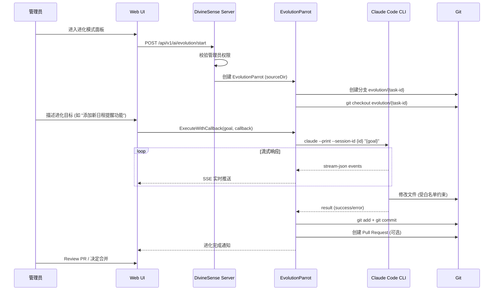

# 🧬 进化模式规格说明书

> **状态**: ✅ 已批准 (Approved)  
> **作者**: Claude (AI) + 用户  
> **批准日期**: 2026-01-30  

---

## 1. 背景与动机

DivineSense 现有的"极客模式🤖" (GeekParrot) 成功实现了通过 Web 界面调度 Claude Code CLI，突破了不同 LLM Agent 的能力限制。然而，当前极客模式的工作目录是用户隔离的沙箱目录 (`~/.divinesense/claude/user_{id}`)，仅用于生成用户可消费的产出物。

**进化模式🧬** 将极客模式的能力指向 **DivineSense 自身的源代码目录**，实现一种"自我编程"能力。

> **核心原则**: CLAUDE.md 是进化模式的"元认知核心"——Agent 必须**读取并遵循** CLAUDE.md 中的规则、架构约定和编码规范来行动，而非仅仅更新它。

AI 代理的进化能力包括：
1. **遵循 CLAUDE.md 行动**: 读取元认知文档，按照其中的规则和约定执行任务
2. **分析自身代码并提出改进**: 基于 CLAUDE.md 定义的架构进行改进
3. **自动实现新功能或修复 Bug**: 严格遵循 CLAUDE.md 中的代码风格和项目结构
4. **元认知同步更新**: 当系统行为发生变化时，同步更新 CLAUDE.md 以保持一致
5. **形成闭环**: 需求 → 遵循规范实现 → 测试 → 更新元认知 → 合并

---

## 2. 模式对比

| 维度           | 🤖 极客模式 (GeekMode)             | 🧬 进化模式 (EvolutionMode)             |
| :------------- | :-------------------------------- | :------------------------------------- |
| **定位**       | 通用任务助手                      | 系统自我进化引擎                       |
| **工作目录**   | `~/.divinesense/claude/user_{id}` | DivineSense 源代码根目录               |
| **产出物用途** | 供 Web 用户浏览/下载              | **强制 GitHub PR**，人工 Review 后合并 |
| **安全等级**   | 中 (用户沙箱隔离)                 | **高** (需管理员权限 + PR 审核)        |
| **会话持久化** | 基于 ConversationID               | 独立进化会话 (不与用户会话混淆)        |
| **触发方式**   | 前端 Toggle 开关                  | 需显式管理员授权                       |
| **失败回滚**   | 不影响系统                        | Git revert 或关闭 PR                   |

---

## 3. 架构设计

### 3.1 核心设计原则

> **关键洞察**: 极客模式与进化模式的技术实现**完全一致**，差异仅在于：
> - 系统提示词不同
> - 权限要求不同
> - 工作空间不同

因此，架构设计将 **Claude Code CLI 集成能力抽象为公共组件 `CCRunner`**，极客/进化模式通过不同配置复用同一底层实现。

### 3.2 组件架构

```
┌─────────────────────────────────────────────────────────────┐
│                      DivineSense Server                     │
├─────────────────────────────────────────────────────────────┤
│                                                             │
│  ┌───────────────────────────────────────────────────────┐  │
│  │                    Mode Layer (模式层)                   │  │
│  ├───────────────────────────────────────────────────────┤  │
│  │  🤖 GeekMode           │       🧬 EvolutionMode         │  │
│  │  - Prompt: 通用助手       │       - Prompt: 遵循 CLAUDE.md   │  │
│  │  - Permission: User   │       - Permission: Admin      │  │
│  │  - Workspace: Sandbox │       - Workspace: SourceCode  │  │
│  └───────────────────────────────────────────────────────┘  │
│                          │                                   │
│                          ▼                                   │
│  ┌───────────────────────────────────────────────────────┐  │
│  │                  CCRunner (公共层)                      │  │
│  ├───────────────────────────────────────────────────────┤  │
│  │  - Claude Code CLI 调用 (--print, stream-json)         │  │
│  │  - 会话管理 (--session-id / --resume)                  │  │
│  │  - 流式输出解析                                       │  │
│  │  - 事件回调分发                                       │  │
│  └───────────────────────────────────────────────────────┘  │
│                          │                                   │
│                          ▼                                   │
│  ┌───────────────────────────────────────────────────────┐  │
│  │              Claude Code CLI (--print)                  │  │
│  └───────────────────────────────────────────────────────┘  │
└─────────────────────────────────────────────────────────────┘
```

### 3.3 代码设计

```go
// plugin/ai/agent/cc_runner.go

// CCRunner 是 Claude Code CLI 的公共集成层，为所有模式提供统一的底层能力
type CCRunner struct {
    cliPath    string         // claude 命令路径
    timeout    time.Duration  // 执行超时
    mu         sync.Mutex     // 并发控制
}

// CCRunnerConfig 定义模式特定的配置
type CCRunnerConfig struct {
    Mode          string   // "geek" | "evolution"
    WorkDir       string   // 工作目录
    SessionID     string   // 会话 ID
    UserID        int32    // 用户 ID
    SystemPrompt  string   // 系统提示词 (模式特定)
    DeviceContext string   // 设备上下文
}

// Execute 执行 Claude Code CLI
func (r *CCRunner) Execute(ctx context.Context, cfg *CCRunnerConfig, prompt string, callback EventCallback) error
```

```go
// plugin/ai/agent/cc_mode.go

// CCMode 定义模式特定的配置和行为
type CCMode interface {
    Name() string                          // 模式名称
    BuildSystemPrompt(cfg *CCRunnerConfig) string   // 构建系统提示词
    GetWorkDir(userID int32) string        // 获取工作目录
    CheckPermission(userID int32) error    // 权限校验
    OnComplete(ctx context.Context) error  // 完成后回调 (进化模式: 创建 PR)
}

// GeekMode 实现
type GeekMode struct{}
func (m *GeekMode) Name() string { return "geek" }
func (m *GeekMode) GetWorkDir(userID int32) string { 
    return fmt.Sprintf("~/.divinesense/claude/user_%d", userID) 
}
func (m *GeekMode) CheckPermission(userID int32) error { return nil } // 所有用户

// EvolutionMode 实现
type EvolutionMode struct {
    sourceDir     string
    gitService    *GitService
    githubService *GitHubService
}
func (m *EvolutionMode) Name() string { return "evolution" }
func (m *EvolutionMode) GetWorkDir(userID int32) string { return m.sourceDir }
func (m *EvolutionMode) CheckPermission(userID int32) error { /* 管理员校验 */ }
func (m *EvolutionMode) OnComplete(ctx context.Context) error { /* 创建 GitHub PR */ }
```

### 3.4 模式配置对比

| 配置项           | 🤖 GeekMode                        | 🧬 EvolutionMode                 |
| :--------------- | :-------------------------------- | :------------------------------ |
| **SystemPrompt** | 通用助手提示词                    | 进化提示词 (强调遵循 CLAUDE.md) |
| **WorkDir**      | `~/.divinesense/claude/user_{id}` | DivineSense 源代码根目录        |
| **Permission**   | 所有已登录用户                    | 仅管理员 + 环境变量启用         |
| **OnComplete**   | 无                                | 创建 GitHub PR                  |

### 3.5 安全机制

进化模式必须严格遵循以下安全约束：

#### 3.3.1 访问控制

| 层级       | 控制点         | 实现方式                             |
| :--------- | :------------- | :----------------------------------- |
| **用户层** | 仅管理员可触发 | `UserRole.Admin` 校验                |
| **API层**  | 独立端点       | `/api/v1/ai/evolution` (非 `/chat`)  |
| **环境层** | 环境变量开关   | `DIVINESENSE_EVOLUTION_ENABLED=true` |

#### 3.3.2 路径白名单/黑名单

```yaml
# 建议的默认配置
allowed_paths:
  - "plugin/"           # AI 代理相关代码
  - "server/"           # 服务端代码
  - "web/src/"          # 前端代码
  - "docs/"             # 文档
  - "CLAUDE.md"         # 元认知文档

forbidden_paths:
  - ".env*"             # 环境变量 (含敏感信息)
  - "*.secret*"         # 密钥文件
  - "deploy/"           # 部署脚本
  - ".git/"             # Git 内部目录
  - "go.mod"            # 依赖文件需人工确认
  - "go.sum"            # 依赖校验和
```

#### 3.3.3 Git 安全策略 (强制 GitHub PR 模式)

1. **强制分支**: 进化模式产生的修改必须提交到独立分支 (`evolution/{task-id}`)
2. **禁止本地合并**: 严禁在本地执行 `git merge` 或 `git push main`
3. **强制 GitHub PR**: 通过 GitHub API 创建 Pull Request，**所有变更必须通过 PR Review 才能合并**
4. **自动化检查**: PR 创建后自动触发 CI (构建、测试、Lint)
5. **回滚能力**: 关闭 PR 即可丢弃变更，或通过 `git revert` 撤销已合并的 PR

### 3.4 进化流程



---

## 4. 实现方案

### 4.1 新增文件

| 文件路径                                       | 职责                                          |
| :--------------------------------------------- | :-------------------------------------------- |
| `plugin/ai/agent/cc_runner.go`                 | **CCRunner 公共层** (CLI 集成核心)            |
| `plugin/ai/agent/cc_mode.go`                   | **CCMode 接口** + GeekMode/EvolutionMode 实现 |
| `plugin/ai/agent/git_service.go`               | Git 操作封装 (分支、提交)                     |
| `plugin/ai/agent/github_service.go`            | GitHub API 集成 (创建 PR)                     |
| `server/router/api/v1/ai/evolution_handler.go` | 进化模式 API 处理                             |
| `proto/api/v1/ai_evolution.proto`              | 进化模式 protobuf 定义                        |

### 4.2 修改文件

| 文件路径                                | 修改内容                                 |
| :-------------------------------------- | :--------------------------------------- |
| `server/router/api/v1/ai/handler.go`    | 增加 `EvolutionMode` 检测和分流          |
| `server/router/api/v1/ai/middleware.go` | `ChatRequest` 增加 `EvolutionMode` 字段  |
| `proto/api/v1/ai.proto`                 | `ChatRequest` 增加 `evolution_mode` 字段 |
| `.env.example`                          | 增加 `DIVINESENSE_EVOLUTION_ENABLED`     |
| `CLAUDE.md`                             | 更新进化元认知章节                       |

### 4.3 System Prompt 设计

进化模式需要专门的 System Prompt，强调：

```text
# Context

You are operating in **Evolution Mode 🧬** inside DivineSense.

**CRITICAL**: You are now modifying DivineSense's OWN source code.
This is a self-evolution scenario where you improve the system you are part of.

## Working Directory
- **Source Root**: {sourceDir}
- **Current Branch**: evolution/{task-id}
- **You MAY modify**: {allowedPaths}
- **You MUST NOT modify**: {forbiddenPaths}

## Evolution Guidelines
1. **Safety First**: Never modify .env, secrets, or deployment configs
2. **Atomic Changes**: Make small, focused commits
3. **Test Before Commit**: Run `make test` before committing
4. **Update Docs**: If you change behavior, update CLAUDE.md
5. **Git Hygiene**: Use conventional commits (feat/fix/refactor)

## Your Goal
{userEvolutionGoal}

Begin by analyzing the relevant code, then propose a plan before making changes.
```

### 4.4 Handler 路由逻辑

```go
// server/router/api/v1/ai/handler.go

func (h *ParrotHandler) Handle(ctx context.Context, req *ChatRequest, stream ChatStream) error {
    // 1. Evolution Mode (最高优先级，需管理员)
    if req.EvolutionMode {
        return h.handleEvolutionMode(ctx, req, stream)
    }
    
    // 2. Geek Mode (次优先级)
    if req.GeekMode {
        return h.handleGeekMode(ctx, req, stream)
    }
    
    // 3. Normal Agent Routing
    // ... existing logic ...
}

func (h *ParrotHandler) handleEvolutionMode(ctx context.Context, req *ChatRequest, stream ChatStream) error {
    // 校验管理员权限
    if !h.isAdmin(req.UserID) {
        return status.Error(codes.PermissionDenied, "Evolution mode requires admin privileges")
    }
    
    // 校验环境变量开关
    if os.Getenv("DIVINESENSE_EVOLUTION_ENABLED") != "true" {
        return status.Error(codes.FailedPrecondition, "Evolution mode is disabled")
    }
    
    // 创建 EvolutionParrot
    evoParrot, err := agentpkg.NewEvolutionParrot(h.getSourceDir(), req.UserID, sessionID)
    if err != nil {
        return status.Error(codes.Internal, err.Error())
    }
    
    // 执行进化任务
    return h.executeAgent(ctx, evoParrot, req, stream, logger)
}
```

---

## 5. UI/UX 设计 (新)

极客模式与进化模式虽然底层技术共享 (CCRunner)，但在用户感知层面应呈现截然不同的视觉隐喻，以区分"工具使用"与"系统进化"。

### 5.1 视觉系统定义

| 维度         | 🤖 极客模式 (Geek Mode)                                            | 🧬 进化模式 (Evolution Mode)                                          |
| :----------- | :---------------------------------------------------------------- | :------------------------------------------------------------------- |
| **视觉隐喻** | **Matrix / Terminal / Cyberpunk**                                 | **DNA / Evolution / Sci-Fi**                                         |
| **核心色调** | 🟢 **Neon Green** (#00FF41) <br> ⚫ **Dark Black** (#0D0208)        | 🟣 **Neon Purple** (#BC13FE) <br> 🔵 **Electric Blue** (#4D4DFF)       |
| **背景效果** | **Digital Rain** (数字雨粒子效果) <br> 扫描线干扰 (CRT Scanlines) | **Double Helix** (DNA 螺旋动态背景) <br> 有机流动光晕 (Organic Flow) |
| **字体风格** | Monospace (Fira Code/JetBrains Mono) <br> 命令行光标闪烁          | Modern Sans (Inter/SF Pro) <br> 优雅呼吸感                           |
| **图标隐喻** | 终端提示符 `>_`, 有线连接 🔌, 芯片 💾                               | DNA 链 🧬, 细胞分裂 🦠, 向上箭头 ⬆️                                     |
| **动态反馈** | 快速滚屏、Glitch (故障) 效果                                      | 平滑过渡、生长动画、进度环                                           |

### 5.2 核心组件设计

#### 5.2.1 进入/切换入口

- **位置**: 侧边栏底部或顶部导航栏明显位置。
- **极客开关**: 点击切换为"沉浸式终端视图"，全屏变暗，出现绿色光标。
- **进化入口**: (仅管理员可见) 带有 DNA 动效的卡片/按钮，点击后展开"进化实验室"面板。

#### 5.2.2 输入区域 (Input Area)

- **Geek Mode**:
  - 样式: 纯文本终端输入框，前缀 `root@divinesense:~$`
  - 交互: 支持 Shell 快捷键 (Ctrl+C, Up/Down History)
- **Evolution Mode**:
  - 样式: 结构化任务卡片，输入框提示 "Describe the evolution goal..."
  - 交互: 支持引用文件 (@filename)、关联 Issue (#issue)

#### 5.2.3 输出流 (Stream Visualization)

- **公共组件 (CCRunner UI)**: 
  - 封装 Claude Code CLI 的 `stream-json` 输出。
  - 支持渲染 `Thinking`, `ToolUse`, `TerminalOutput`, `Error` 事件。

- **Geek Mode 渲染**:
  - **Raw Stream**: 尽可能保留 CLI 原始输出风格。
  - **Speed**: 无缓冲快速滚屏，营造"黑客"感。
  - **Color**: 高对比度绿色文字。

- **Evolution Mode 渲染**:
  - **Structured Phases**: 将输出折叠为阶段卡片：
    1. 🧠 **Analyzing** (分析代码)
    2. 📝 **Planning** (生成计划)
    3. 🔨 **Coding** (修改代码/Git操作)
    4. ✅ **Verifying** (运行测试)
  - **关键信息高亮**: 仅展开显示关键决策和文件变更，折叠冗长的终端日志。
  - **PR Card**: 进化结束时展示 GitHub PR 卡片 (Title, Diff Stats, Merge Button)。

### 5.3 状态反馈 (Status & Feedback)

| 状态          | Geek 表现                           | Evolution 表现                  |
| :------------ | :---------------------------------- | :------------------------------ |
| **Idle**      | 光标闪烁 `_`                        | DNA 链缓慢自旋                  |
| **Thinking**  | 快速变化的随机字符流 (Decoding...)  | 神经网络节点激活脉冲            |
| **Executing** | 终端进度条 `[###...]`               | 细胞分裂/融合动画               |
| **Success**   | `SYSTEM_READY` (绿色块状提示)       | `EVOLUTION_COMPLETE` (紫色辉光) |
| **Error**     | `SYSTEM_FAILURE` (红色 Glitch 报警) | `MUTATION_FAILED` (DNA 断裂)    |

---

## 6. 验证计划

### 6.1 单元测试

| 测试文件                    | 测试内容               |
| :-------------------------- | :--------------------- |
| `evolution_parrot_test.go`  | 配置解析、路径校验逻辑 |
| `git_service_test.go`       | Git 操作 mock 测试     |
| `evolution_handler_test.go` | 权限校验、模式分流     |

### 6.2 集成测试

1. **路径白名单测试**: 尝试修改禁止路径，验证拒绝
2. **分支创建测试**: 验证进化操作创建独立分支
3. **回滚测试**: 验证 Git revert 能力

### 6.3 人工验证

由于进化模式涉及对源代码的真实修改，建议：

1. 在**独立的 Git 仓库副本**中测试 (非主仓库)
2. 管理员手动触发一个小型进化任务 (如 "添加一行注释到 CLAUDE.md")
3. 验证 PR 创建、分支隔离、回滚等关键流程

---

## 7. 风险与缓解

| 风险         | 严重性 | 缓解措施                  |
| :----------- | :----: | :------------------------ |
| 恶意代码注入 |  🔴 高  | 路径白名单 + 人工 Review  |
| 敏感信息泄露 |  🔴 高  | 禁止修改 .env、secrets    |
| 破坏性变更   |  🟠 中  | 独立分支 + 自动 PR        |
| 测试覆盖不足 |  🟠 中  | 强制 `make test` 通过     |
| 文档不同步   |  🟡 低  | Prompt 要求更新 CLAUDE.md |

---

## 8. 里程碑

| 阶段   | 目标                                   | 预估工作量 |
| :----- | :------------------------------------- | :--------- |
| **M1** | EvolutionParrot 基础实现 (无 Git 操作) | 2-3 天     |
| **M2** | Git 服务集成 (分支、提交、PR)          | 2 天       |
| **M3** | 安全约束和权限校验                     | 1 天       |
| **M4** | 前端进化模式面板                       | 2-3 天     |
| **M5** | 测试与文档                             | 1-2 天     |

**总计**: 约 8-11 天

---
## 9. 参考资料

- [CLAUDE.md 元认知系统章节](file:///Users/huangzhonghui/divinesense/CLAUDE.md#元认知系统)
- [GeekParrot 实现](file:///Users/huangzhonghui/divinesense/plugin/ai/agent/geek_parrot.go)
- [Claude Code CLI 安全最佳实践](https://claude.com/docs/security)
- [OpenClaw 自进化设计](https://github.com/openclaw/openclaw)
