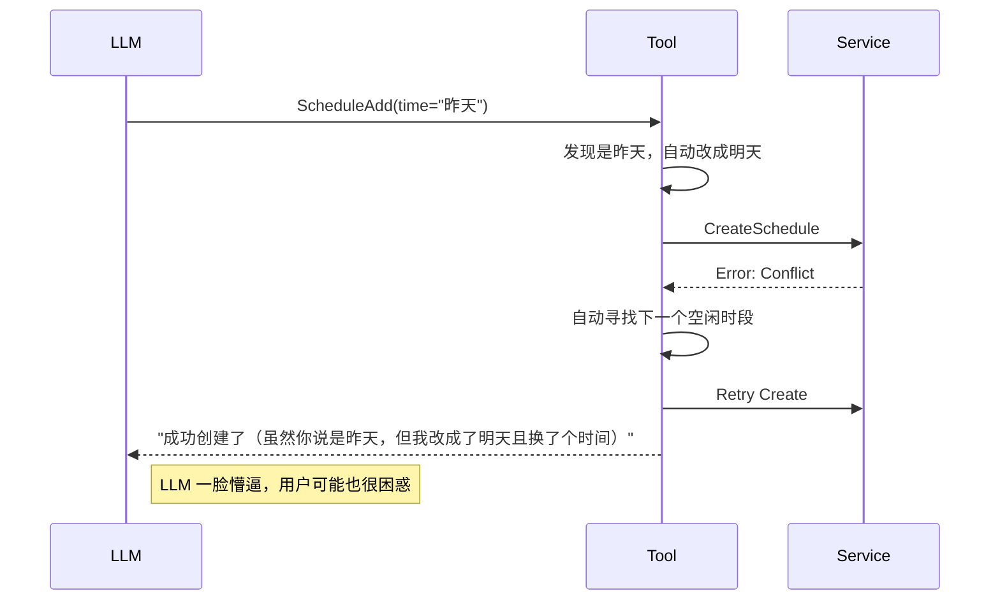
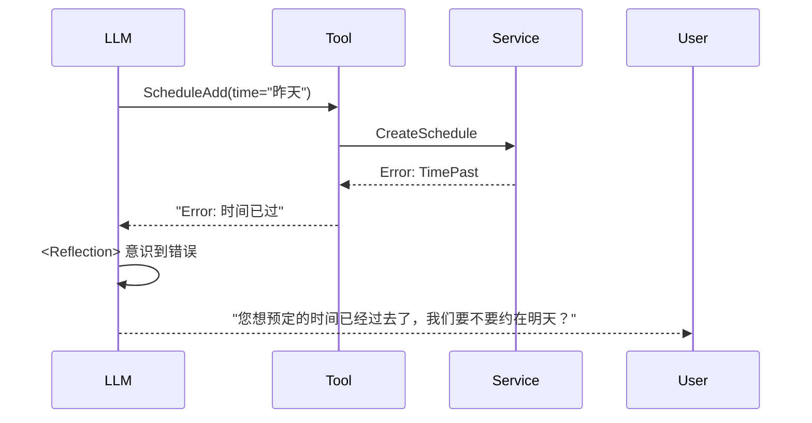

# P2-01: Scheduler 极简重构 — Smart Agent 模式

> **阶段**: Phase 2 — 核心重构  
> **原则**: Smart Agent / Thin Tool / Rich Service  
> **目标**: 代码量减半 (1200+ -> ~500行)，职责归位  
> **相关的 Issue**: [#180](https://github.com/hrygo/divinesense/issues/180)

---

## 1. 核心理念：减法与信任

原 `scheduler.go` 是一个典型的 **"保姆式"** 实现：它不信任 LLM 的理解能力，也不信任 Service 层的业务能力，自己把解析、校验、修正、重试全干了。

本次重构执行 **"Smart Agent"** 模式：

1.  **Smart LLM**: 相信 Prompt 定义的 `<Analyze>` & `<Validation>` 协议。LLM 负责理解用户意图、检查显而易见的逻辑错误（如凌晨3点开会）。
2.  **Thin Tool**: 工具层退化为 **纯粹的适配器 (Adapter)**。它只负责：
    *   将 LLM 的 JSON 参数转换为 Go 结构体。
    *   调用领域服务 (`ai/services/schedule`)。
    *   将结果（或错误）格式化为 LLM 可读的字符串。
3.  **Rich Service**: 业务逻辑回归领域层。时间硬化、冲突检测、空闲时段查找，全部由 `ai/services/schedule` 提供。

---

## 2. 减法清单 (The Kill List)

我们将**删除** `scheduler.go` 中约 **60%** 的代码：

### 2.1 减法清单 (Tool Layer)

我们将**删除** `scheduler.go` 中约 **60%** 的代码：

| 模块           | 删除内容                          | 原因                                                        | 替代方案                                              |
| :------------- | :-------------------------------- | :---------------------------------------------------------- | :---------------------------------------------------- |
| **防御性修正** | `adjustPastTime` (过去时间修正)   | 越俎代庖。LLM 应在 Validation 阶段拦截，或由 Service 报错。 | Service 层校验 + LLM 反思                             |
| **防御性修正** | `adjustNightHour` (夜间时间修正)  | 业务绑架。用户可能真想约夜间会议。                          | Service 层警告 (可选)                                 |
| **自动化流程** | `ConflictResolver` 重试循环       | 隐藏了冲突事实。LLM 需要知道冲突细节才能与用户交互。        | Service 返回冲突详情 -> Tool 返回错误信息 -> LLM 决定 |
| **冗余逻辑**   | `FindFreeTime` 遍历逻辑           | 业务逻辑泄露到工具层。                                      | 调用 `PrecheckService` (需导出方法)                   |
| **重复实现**   | RFC3339 解析逻辑                  | 与 `parser.go` / `time_hardener.go` 重复。                  | 复用 `TimeHardener` (Strict Mode)                     |
| **重复常量**   | `DefaultTimezone`, `businessHour` | 散落在各处。                                                | 统一引用 `ai/agents/tools/schedule/common.go`         |

### 2.2 减法清单 (Service Layer - The "Pile of S**t" Cleanup)

用户指出 `ai/services/schedule` 臃肿不堪，经排查发现存在“双重智能”、“过度设计”和“错位职责”。我们将由繁化简，**删除 70% 以上的代码**：

| 文件                            | 删除内容                    | 现状分析                                                                       | 处置方案                                                                      |
| :------------------------------ | :-------------------------- | :----------------------------------------------------------------------------- | :---------------------------------------------------------------------------- |
| `parser.go`                     | **整文件删除** (380行)      | 内部调用 LLM 解析。**冗余**：Agent 本身就是 LLM。                              | **DELETE**. Agent 输出即结构化参数。                                          |
| `batch_schedule.go`             | **整文件删除** (480行)      | 复杂的批量调度逻辑。**过度设计**：Agent 场景极少用，且可循环调用单次接口替代。 | **DELETE**. YAGNI (You Check It, You Don't Need It).                          |
| `schedule_intent_classifier.go` | **整文件删除** (330行)      | 正则意图分类。**错位**：这是 Router 的活，Service 不该管。                     | **DELETE**. 依赖 Router Agent 分发。                                          |
| `timezone_validator.go`         | **整文件删除** (250行)      | 处理夏令时边缘情况。**过度封装**：Go `time` 包已足够健壮，边缘 case 极其罕见。 | **DELETE**. 信任 Go 标准库处理。                                              |
| `time_hardener.go`              | **删除 NLP/Regex** (~200行) | 正则解析中文时间。**愚蠢**：LLM 才是解析自然语言的专家。                       | **Slim Down**. 仅保留 `ValidateTime`。                                        |
| `recurrence.go`                 | **删除 NLP/Regex** (~100行) | 正则解析 "每天"。**冗余**：LLM 可直接生成 JSON 规则。                          | **Slim Down**. 仅保留 `GenerateInstances` 计算逻辑。                          |
| `precheck_service.go`           | **重构**                    | 混合了 Store 和 Warning 逻辑。                                                 | **Refactor**. 提取纯净的 `AvailabilityService`，删除所有 Warning/Suggestion。 |

> **极简主义信条**: 
> 1. 如果 LLM 能做，Service 就不做（不做 NLP）。
> 2. 如果 Go 标准库能做，Service 就不封装（不搞 TimezoneValidator）。
> 3. 如果现在没用，直接删（不搞 Batch/Intent）。

## 3.3 能力迁移对照表 (Capability Preservation)

我们删除了代码，但没有删除能力。能力从 **Go Code** 转移到了 **LLM Prompt** 和 **Agent Pattern**。

| 原有能力             | 原实现方式 (Code)                            | 新实现方式 (AI-Native)                               | 能力评估                           |
| :------------------- | :------------------------------------------- | :--------------------------------------------------- | :--------------------------------- |
| **自然语言时间解析** | `parser.go` 调 LLM + `time_hardener.go` 正则 | Prompt 注入当前时间 + COT 思维链                     | ✅ **更强** (LLM 理解力 > 正则)     |
| **模糊时间推断**     | `hardener` 推断 "明天" (if past)             | Prompt: "Given current time X, calculate 'Tomorrow'" | ✅ **持平**                         |
| **批量创建**         | `batch_schedule.go` 复杂逻辑                 | Agent ReAct 循环 (Call tool multiple times)          | ✅ **更灵活**                       |
| **意图分类**         | `classifier.go` 正则匹配                     | Router Agent (LLM 语义路由)                          | ✅ **更准**                         |
| **循环规则解析**     | `recurrence.go` 正则匹配                     | LLM 直接生成 JSON Rule                               | ✅ **持平**                         |
| **冲突自动解决**     | Tool 内联重试逻辑                            | Error -> Reflection -> Ask User / FindFreeTime       | ✨ **交互更优** (拒绝静默修改)      |
| **夏令时边缘处理**   | `timezone_validator.go`                      | Go `time` 标准库                                     | 🟢 **足够** (标准库已涵盖 99% 场景) |

---

### 3.1 极简实现预览
不再区分 Add/Query/Free 文件，核心在于 Prompt，Go Code 退化为适配层。

目录结构:
```
ai/agents/tools/schedule/
├── common.go   # 类型定义 + ISO校验
├── tools.go    # Add/Query/Free/Update 全部在此 (合计 < 400行)
```

### 3.2 交互时序变化

**AS-IS (现状 - 保姆模式):**


**TO-BE (未来 - 专家模式):**


这种模式下，**错误是反馈循环的一部分**，而不是需要被掩盖的异常。

---

## 4. 代码实现预览

### 4.1 通用层 (`common.go`)

```go
package schedule

import "time"

// 权威常量定义
const (
    DefaultTimezone = "Asia/Shanghai"
    SchedulableStartHour = 6
    SchedulableEndHour   = 22
)

// 复用现有基础设施，避免重造轮子
// normalizeJSONFields 依然保留，因为这是适配 LLM 不稳定输出的必要层
// 但应简化实现
```

### 4.2 极简创建工具 (`add.go`)

```go
type ScheduleAddTool struct {
    service schedule.Service 
}

func (t *ScheduleAddTool) Run(ctx context.Context, inputJSON string) (string, error) {
    // 1. 基础解析 (借助 common.ParseInput)
    params, err := parseAddParams(inputJSON)
    if err != nil {
        return "", err // 格式错误直接返回，LLM 会修正
    }

    // 2. 直接调用 Service
    // 不做 adjustPastTime，不做 adjustNightHour
    // Service层应该负责基本的参数校验（如结束时间大于开始时间）
    schedule, err := t.service.CreateSchedule(ctx, params.ToCreateRequest())
    
    if err != nil {
        // 3. 智能错误反馈
        // 如果是冲突错误，Service 应返回结构化错误信息
        // Tool 将其转换为自然语言提示，引导 LLM 进行 <Reflection>
        if isConflict(err) {
            return fmt.Sprintf("创建失败：时间冲突。\n%s", formatConflictDetails(err)), nil
        }
        return "", fmt.Errorf("创建失败: %w", err)
    }

    // 4. 成功反馈
    return fmt.Sprintf("✅ 已创建日程：%s @ %s", schedule.Title, formatTime(schedule.StartTs)), nil
}
```

### 4.2 工具适配层 (`tools.go`)

```go
type Tools struct { service schedule.Service }

// Add: 15行核心逻辑
func (t *Tools) ScheduleAdd(ctx context.Context, input string) (string, error) {
    req, err := parse[CreateReq](input)
    if err != nil { return "", err } 
    // 让 Service 校验逻辑（如结束时间 > 开始时间）
    res, err := t.service.Create(ctx, req) 
    if err != nil {
        if isConflict(err) { return formatConflict(err), nil } // 暴露冲突给 LLM
        return "", err
    }
    return formatSuccess(res), nil
}

// Free: 10行 (直接透传)
func (t *Tools) FindFreeTime(ctx context.Context, input string) (string, error) {
    req, err := parse[FreeReq](input)
    slots := t.service.FindAvailableSlots(ctx, req)
    if len(slots) == 0 { return "No slots found", nil }
    return formatSlots(slots), nil
}
```

---

## 5. 实施计划

### Step 0: Pre-Verification
```bash
go test ./ai/agents/tools/...
```

### Step 1: 领域层大扫除 (Service Radical Cleanup)
在 `ai/services/schedule/` 中：
1.  **Delete**: `parser.go`, `batch_schedule.go`, `intent_classifier.go`, `timezone_validator.go`
2.  **Slim**: `time_hardener.go` (No NLP), `recurrence.go` (No NLP)
3.  **Refactor**: `precheck_service.go` -> `availability.go`

### Step 2: 极简工具层 (Agent Tool Rewrite)
1.  新建 `ai/agents/tools/schedule/`
2.  实现 `tools.go` (包含 Add/Query/Update/Free), `common.go`
3.  总代码量控制在 **400行以内**。

### Step 3: Prompt 增强 (Critical)

没有了 Hardener，Prompt 必须足够强壮。更新 `schedule.yaml`：

```yaml
system_prompt: |
  ## Identity & Capability
  You are ScheduleParrot.
  CRITICAL: You MUST process time naturally relative to CURRENT_TIME.
  
  ## Time Protocol (Strict)
  1. CURRENT_TIME: {{.Now}} (Always use this as reference)
  2. ISO8601 ONLY: Tools only accept "2006-01-02T15:04:05+08:00"
  3. CALCULATION:
     - "Tomorrow 3pm" -> Calculate based on CURRENT_TIME
     - "Next Tuesday" -> Calculate date
  4. ERROR HANDLING:
     - If tool returns "Conflict", READ the suggested time in error message
     - Ask user: "The time conflict with [Event], how about [Suggestion]?"
```


### Step 4: 替换与验证
1.  在 `registry.go` 中替换旧 Tool 为新 Tool。
2.  **Verify**: 测试 LLM 是否正确处理 `Next Tuesday` -> ISO8601。
3.  **Verify**: 测试 LLM 是否正确处理 `Conflict`。


---

## 6. 验收标准

1.  **代码量**: 新包 `ai/agents/tools/schedule` 总行数应 < 600 行。
2.  **无业务逻辑**: Tool 层不包含任何 `if hour < 6` 这种业务判断。
3.  **错误透传**: `schedule_add` 在冲突时应返回包含 "时间冲突" 字样的 Result（而非 Error 类型，以便 LLM 读取），并包含 Service 建议的替代时间。
