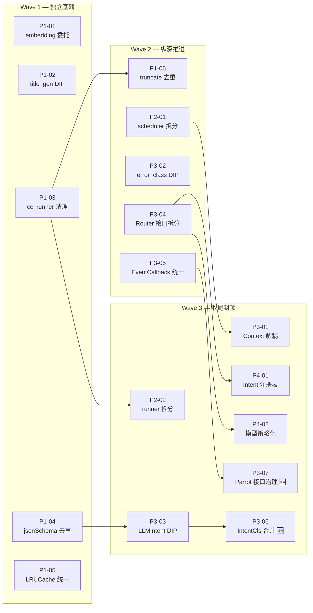

# AI 包 DRY + SOLID 重构 — 任务规格索引

> **架构参考**: [ai-solid-refactoring-plan.md](../../architecture/ai-solid-refactoring-plan.md)  
> **审计状态**: ✅ 已审计并修正，覆盖率 100%（2026-02-13）  
> **审计报告**: [AUDIT.md](./AUDIT.md)

---

## 覆盖审计矩阵

下表展示架构方案中每个违规诊断项到 Spec 的完整映射：

### SOLID 违规 → Spec 映射

| ID     | 违规项                                       | 原则 | 严重度 | Spec          |
| :----- | :------------------------------------------- | :--- | :----- | :------------ |
| SRP-S1 | `scheduler.go` 38KB 上帝工具                 | SRP  | ❌ 严重 | ✅ P2-01       |
| SRP-S2 | `runner.go` 35KB 上帝类                      | SRP  | ❌ 严重 | ✅ P2-02       |
| SRP-S3 | `context.go` 日程领域耦合                    | SRP  | ❌ 严重 | ✅ P3-01       |
| SRP-S4 | `cc_runner.go` 纯桥接层                      | SRP  | ❌ 严重 | ✅ P1-03       |
| SRP-M1 | `embedding.go` 混合接口+实现                 | SRP  | ⚠️ 轻度 | ✅ P1-01       |
| SRP-M2 | `title_generator.go` 直接依赖 openai         | SRP  | ⚠️ 轻度 | ✅ P1-02       |
| SRP-M3 | `llm_intent_classifier.go` 直接依赖 openai   | SRP  | ⚠️ 轻度 | ✅ P3-03       |
| OCP-S1 | Intent 枚举 + 映射 硬编码                    | OCP  | ❌ 严重 | ✅ P4-01       |
| OCP-S2 | `chat_router.go` switch 硬编码               | OCP  | ❌ 严重 | ✅ P4-01       |
| OCP-S3 | `intent_classifier.go` 关键词嵌入            | OCP  | ❌ 严重 | ✅ P4-01       |
| OCP-S4 | SelectModel switch 硬编码                    | OCP  | ❌ 严重 | ✅ P4-02       |
| LSP-P1 | EventCallback 签名不一致                     | LSP  | ⚠️ 潜在 | ✅ P3-05       |
| LSP-P2 | ParrotAgent Execute/ExecuteWithCallback 重叠 | LSP  | ⚠️ 潜在 | ✅ **P3-07** 🆕 |
| ISP-S1 | ConversationContext 领域耦合                 | ISP  | ❌ 严重 | ✅ P3-01       |
| ISP-S2 | RouterService SelectModel 混合               | ISP  | ❌ 严重 | ✅ P3-04       |
| DIP-S1 | `error_class.go` 跨层导入                    | DIP  | ❌ 严重 | ✅ P3-02       |
| DIP-S2 | `llm_intent_classifier.go` 直接 openai       | DIP  | ❌ 严重 | ✅ P3-03       |
| DIP-S3 | `title_generator.go` 直接 openai             | DIP  | ❌ 严重 | ✅ P1-02       |
| DIP-S4 | `embedding.go` 持有具体实现                  | DIP  | ❌ 严重 | ✅ P1-01       |
| DIP-S5 | `context.go` 导入 store/schedule             | DIP  | ❌ 严重 | ✅ P3-01       |

### DRY 违规 → Spec 映射

| ID     | 违规项                     | 冗余行数 | Spec               |
| :----- | :------------------------- | :------- | :----------------- |
| DRY-S1 | `jsonSchema` 2 处重复      | ~26 行   | ✅ P1-04            |
| DRY-S2 | `LRUCache` 3 处重复        | ~300 行  | ✅ P1-05            |
| DRY-T1 | `EventCallback` 3 处不一致 | ~30 行   | ✅ P3-05            |
| DRY-L1 | IntentClassifier 双轨并行  | ~400 行  | ✅ **P3-06** 🆕      |
| DRY-L2 | `truncate` 6 处重复        | ~60 行   | ✅ P1-06 (审计修正) |
| DRY-B1 | `cc_runner.go` 桥接层冗余  | ~250 行  | ✅ P1-03            |

> **审计结论**: 原 15 个 Spec 发现 **2 个覆盖缺口**，已补充 P3-06、P3-07，当前 **17 个 Spec 完全覆盖** 架构方案中所有 26 项违规诊断。

---

## 依赖关系图



### 依赖链清单

| Spec    | 前置依赖  | 原因                                                                  |
| :------ | :-------- | :-------------------------------------------------------------------- |
| P1-06   | **P1-03** | cc_runner.go 的 `TruncateString` 别名需先清除                         |
| P2-02   | **P1-03** | runner 拆分前需确保 cc_runner 桥接层已移除                            |
| P3-01   | **P2-01** | scheduler 拆分后创建 `schedule/` 子包，context 中的领域类型迁入此包   |
| P3-03   | **P1-04** | jsonSchema 已统一到 `core/llm/schema.go` 后再重构 LLMIntentClassifier |
| P3-06 🆕 | **P3-03** | LLMIntentClassifier DIP 完成后再合并双轨分类器                        |
| P3-07 🆕 | **P3-05** | EventCallback 统一后再治理 ParrotAgent 接口                           |
| P4-01   | **P3-04** | RouterService 拆分出 `IntentClassifier` 接口后才能建注册表            |
| P4-02   | **P3-04** | RouterService 拆分出 `ModelSelector` 接口后才能策略化                 |

---

## 实施矩阵

> 三波并行执行，每波内的 Spec 可同时进行。

### Wave 1 — 独立基础（5 个，可完全并行）

| ID    | Spec                                                     | 原则 | 工作量 | 风险 | 依赖 | Issue |
| :---- | :------------------------------------------------------- | :--- | :----- | :--- | :--- | :---- |
| P1-01 | [embedding.go 委托重构](./P1-01-embedding-delegate.md)   | DIP  | 0.5d   | 🟢    | 无   | [#174](https://github.com/hrygo/divinesense/issues/174) |
| P1-02 | [title_generator.go DIP](./P1-02-title-generator-dip.md) | DIP  | 0.5d   | 🟢    | 无   | [#175](https://github.com/hrygo/divinesense/issues/175) |
| P1-03 | [cc_runner.go 清理](./P1-03-cc-runner-cleanup.md)        | SRP  | 1d     | 🟢    | 无   | [#176](https://github.com/hrygo/divinesense/issues/176) |
| P1-04 | [jsonSchema 去重](./P1-04-json-schema-dedup.md)          | DRY  | 0.5d   | 🟢    | 无   | [#177](https://github.com/hrygo/divinesense/issues/177) |
| P1-05 | [LRUCache 统一](./P1-05-lru-cache-dedup.md)              | DRY  | 1d     | 🟡    | 无   | [#178](https://github.com/hrygo/divinesense/issues/178) |

**预计耗时**: 1 天（5 人并行）/ 3.5 天（1 人串行）

---

### Wave 2 — 纵深推进（5 个，可完全并行）

| ID    | Spec                                                    | 原则    | 工作量 | 风险 | 依赖    | Issue |
| :---- | :------------------------------------------------------ | :------ | :----- | :--- | :------ | :---- |
| P1-06 | [truncate 去重](./P1-06-truncate-dedup.md)              | DRY     | 1d     | 🟢    | ← P1-03 | [#179](https://github.com/hrygo/divinesense/issues/179) |
| P2-01 | [scheduler.go 拆分](./P2-01-scheduler-split.md)         | SRP     | 3d     | 🟡    | 无      | [#180](https://github.com/hrygo/divinesense/issues/180) |
| P3-02 | [error_class DIP](./P3-02-error-class-dip.md)           | DIP     | 1d     | 🟡    | 无      | [#181](https://github.com/hrygo/divinesense/issues/181) |
| P3-04 | [RouterService 拆分](./P3-04-router-interface-split.md) | ISP     | 1d     | 🟡    | 无      | [#182](https://github.com/hrygo/divinesense/issues/182) |
| P3-05 | [EventCallback 统一](./P3-05-event-callback-unify.md)   | DRY/LSP | 1d     | 🟡    | 无      | [#183](https://github.com/hrygo/divinesense/issues/183) |

**预计耗时**: 3 天（多人并行）/ 6.5 天（1 人串行）

---

### Wave 3 — 收尾封顶（7 个，可完全并行）

| ID    | Spec                                                          | 原则    | 工作量 | 风险 | 依赖    | Issue |
| :---- | :------------------------------------------------------------ | :------ | :----- | :--- | :------ | :---- |
| P2-02 | [runner.go 拆分](./P2-02-runner-split.md)                     | SRP     | 3d     | 🟡    | ← P1-03 | [#184](https://github.com/hrygo/divinesense/issues/184) |
| P3-01 | [Context 领域解耦](./P3-01-context-decouple.md)               | ISP/SRP | 2d     | 🟡    | ← P2-01 | [#185](https://github.com/hrygo/divinesense/issues/185) |
| P3-03 | [LLMIntentClassifier DIP](./P3-03-llm-intent-dip.md)          | DIP     | 0.5d   | 🟢    | ← P1-04 | [#186](https://github.com/hrygo/divinesense/issues/186) |
| P3-06 | [IntentClassifier 合并](./P3-06-intent-classifier-merge.md) 🆕 | DRY/SRP | 1.5d   | 🟡    | ← P3-03 | [#187](https://github.com/hrygo/divinesense/issues/187) |
| P3-07 | [ParrotAgent 接口治理](./P3-07-parrot-interface-cleanup.md) 🆕 | LSP/ISP | 1d     | 🟡    | ← P3-05 | [#188](https://github.com/hrygo/divinesense/issues/188) |
| P4-01 | [Intent 注册表](./P4-01-intent-registry.md)                   | OCP     | 2d     | 🟡    | ← P3-04 | [#189](https://github.com/hrygo/divinesense/issues/189) |
| P4-02 | [模型选择策略化](./P4-02-model-strategy.md)                   | OCP     | 1d     | 🟡    | ← P3-04 | [#190](https://github.com/hrygo/divinesense/issues/190) |

**预计耗时**: 3 天（多人并行）/ 11 天（1 人串行）

---

## 总体工期估算

| 模式                         | Wave 1 | Wave 2 | Wave 3 | 总计           |
| :--------------------------- | :----- | :----- | :----- | :------------- |
| **最大并行**（每波内全并行） | 1d     | 3d     | 3d     | **~7 工作日**  |
| **单人串行**                 | 3.5d   | 6.5d   | 11d    | **~21 工作日** |
| **建议节奏**（1-2 人交替）   | 2d     | 4d     | 5d     | **~11 工作日** |

---

## 关键路径

```
P1-03 → P2-02 (runner 拆分)                    = 1d + 3d = 4d
P2-01 → P3-01 (Context 解耦)                   = 3d + 2d = 5d
P1-04 → P3-03 → P3-06 (IntentCls 合并)         = 0.5d + 0.5d + 1.5d = 2.5d
P3-04 → P4-01 (Intent 注册表)                   = 1d + 2d = 3d
P3-05 → P3-07 (Parrot 接口治理)                 = 1d + 1d = 2d
```

**关键路径**: `P2-01 → P3-01`（5 天），决定整体最短工期。

---

## 验证策略

每个 Spec 完成后执行：

```bash
go build ./...                    # 编译通过
go test ./ai/... -count=1 -v     # 全量单元测试
go vet ./ai/...                  # 静态分析
```

每个 Wave 完成后执行：

```bash
go test ./... -count=1            # 全项目测试
```

---

## 本期不纳入的已知技术债

> 以下问题在审计中发现，scope 超出本次重构范围，记录供后续 Epic 跟踪。

| 类型       | 描述                                    | 涉及范围         |
| :--------- | :-------------------------------------- | :--------------- |
| 系统性 DIP | `store` 包被 ai/ 子树 17 个文件直接导入 | 全 ai/ 子包      |
| OCP 轻度   | `calculateCost` 硬编码模型定价 switch   | `base_parrot.go` |
