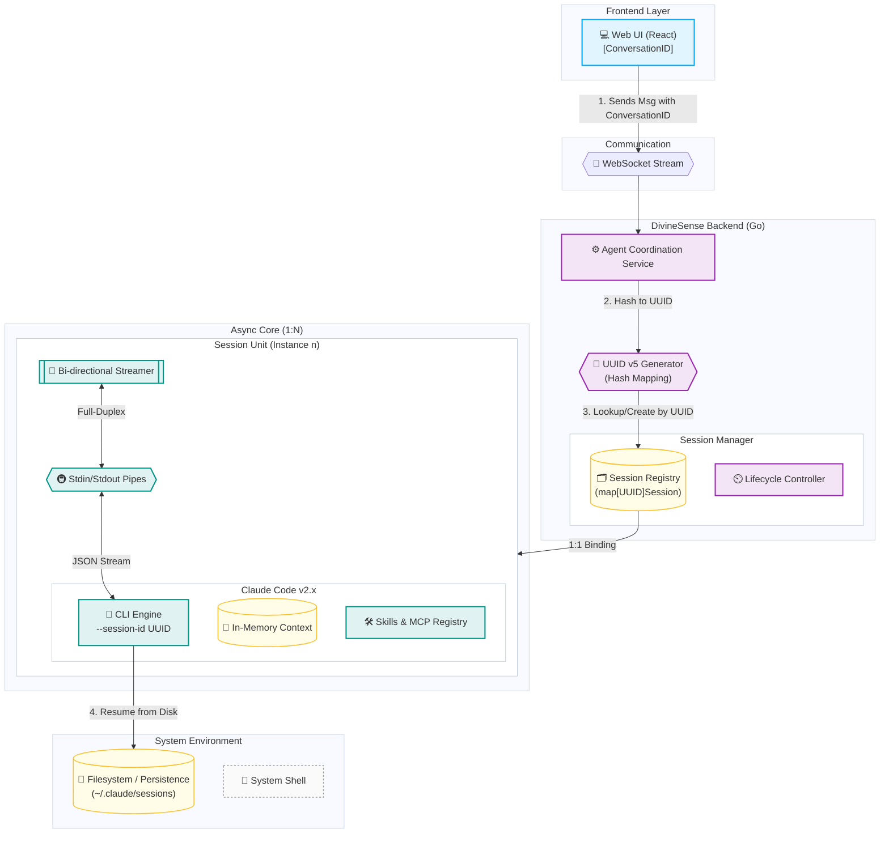

# CC Runner 异步架构规格说明书 (Async Architecture Spec)

**Status**: Published
**Version**: 1.2
**Context**: [Research: CC Runner Async Upgrade](../research/cc-runner-async-upgrade.md)

## 1. 概述 (Overview)

本规格说明书详细定义了 `cc_runner` 从一次性执行（One-shot）向全双工异步持久化（Full-Duplex Persistent）架构演进的技术标准。

### 1.1 核心目标
- **持久化会话**: 保持 Claude Code CLI 进程存活，避免重复启动开销。
- **全双工交互**: 支持在执行过程中随时注入用户反馈 (Human-in-the-loop)。
- **实时流式**: 提供毫秒级的 Token 级输出和工具执行状态更新。

## 2. 系统架构 (System Architecture)



### 2.1 会话隔离与连续性 (Session Model)

架构必须确保多用户/多任务场景下的严格隔离与状态保持。

- **隔离性 (Isolation)**: 
    - **1:N 管理模型**: 系统维护一个单例的 `Session Manager` (1)，负责协调和路由指令到多个并存的 `Session Units` (N)。
    - **物理隔离**: 基于 `SessionID` 进行硬隔离。每个 Session 对应一个独立的 OS 进程 (`exec.Cmd`)，确保进程级别的安全性。
    - **资源独立**: 每个进程拥有独立的内存空间（上下文）、IO 管道和文件描述符。
    - **互不干扰**: Session A 的环境变更（如 `cd` 切换目录、设置环境变量）仅在其进程内生效，绝不会泄露给 Session B。并发的 Session 可以安全地并行运行。

- **连续性 (Continuity)**: 
    - **进程级保持**: 只要 Session 未被销毁（未达到 30m 空闲超时或被显式 Terminate），底层进程一直保持运行（Running/Sleep）。
    - **上下文驻留**: AI 的对话历史（Conversation History）完全保留在 `claude` 进程的内存中。后端 `Session Manager` 无需在应用层序列化/反序列化聊天记录，只需通过管道透传增量数据。
    - **多轮交互**: 后续的 WebSocket 消息（如用户并行的追问）直接写入对应进程的 Stdin，无缝延续上下文。

### 2.2 会话映射模型 (Session Mapping)

前端 UI 的“对话”与后端的“进程会话”之间存在严格的 **1:1 确定性映射**。

- **标识转换**: 
    - 前端使用数据库 ID (`ConversationID`) 标识聊天窗口。
    - 后端通过 `UUID v5` 定向哈希算法（以 `ConversationID` 为 Seed）生成符合 Claude Code CLI 要求的 `sessionID` (UUID)。
- **确定性映射 (Deterministic Mapping)**:
    - `Map(ConversationID) -> UUID v5(Namespace, "divinesense:conversation:{ID}")`
    - 这种设计确保了即便后端重启或内存缓存失效，只要 `ConversationID` 不变，生成的 `sessionID` 保持恒定。
- **状态恢复 (Resume)**:
    - Claude Code CLI 内部会将对话历史持久化于磁盘。
    - 由于 `sessionID` 恒定且唯一，后端启动 CLI 时带上 `--session-id <UUID>` 即可实现**自动重连与上下文恢复**，无需后端应用层干预。

## 3. 核心组件定义 (Component Definitions)

### 3.1 Session Manager (会话管理器)

负责全生命周期的进程管理。

**Interface Definition (Go):**

```go
type SessionManager interface {
    // 启动或获取已存在的会话
    GetOrCreateSession(ctx context.Context, sessionID string, config SessionConfig) (*Session, error)
    
    // 终止会话
    TerminateSession(sessionID string) error
    
    // 获取活跃会话列表
    ListActiveSessions() []SessionMeta
}
```

**Data Structures:**

```go
type Session struct {
    ID          string
    Cmd         *exec.Cmd
    Stdin       io.WriteCloser
    Stdout      io.ReadCloser
    Cancel      context.CancelFunc
    CreatedAt   time.Time
    LastActive  time.Time
    Status      SessionStatus // Starting, Ready, Busy, Dead
    
    // 互斥锁保护并发读写
    mu          sync.RWMutex
}
```

### 3.2 Bi-directional Streamer (双向流转换器)

负责协议转换：HTTP/WS 消息 <-> CLI JSON Stream。

**Input (User -> CLI):**
用户输入被封装为标准 JSON 注入 Stdin。

```json
// Protocol: User Input Injection
{
    "type": "user",
    "message": {
        "role": "user",
        "content": [{"type": "text", "text": "continue"}]
    }
}
```

**Output (CLI -> User):**
解析 CLI 的 `stream-json` 输出，转换为 UI 可消费的事件。

```go
type StreamEvent struct {
    Type      string           `json:"type"`      // thinking, tool_use, tool_result, answer, error
    Content   string           `json:"content"`   // 文本内容
    Meta      *StreamEventMeta `json:"meta"`      // 强类型元数据
    Timestamp int64            `json:"timestamp"`
}

type StreamEventMeta struct {
    ToolName  string `json:"tool_name,omitempty"`
    ToolID    string `json:"tool_id,omitempty"`
    IsError   bool   `json:"is_error,omitempty"`
    FilePath  string `json:"file_path,omitempty"`
    SessionID string `json:"session_id,omitempty"`
}
```

## 4. 交互协议 (Interaction Protocol)

### 4.1 WebSocket 消息格式

**Client -> Server:**

| Event Type      | Payload         | Desc         |
| :-------------- | :-------------- | :----------- |
| `session.start` | `{config: ...}` | 启动新会话   |
| `input.send`    | `{text: "yes"}` | 发送用户输入 |
| `session.stop`  | `{}`            | 强制停止     |

**Server -> Client:**

| Event Type    | Payload                                      | Desc                   |
| :------------ | :------------------------------------------- | :--------------------- |
| `thinking`    | `{content: "..."}`                           | 思考过程 (增量)        |
| `tool_use`    | `{content: "Name", meta: {name, input, id}}` | 工具调用               |
| `tool_result` | `{content: "...", meta: {is_error}}`         | 工具结果               |
| `answer`      | `{content: "..."}`                           | 最终回答 (增量)        |
| `error`       | `{content: "..."}`                           | 系统级错误             |

> **Note**: Event types align with frontend `ParrotEventType` enum for compatibility.

## 5. 关键流程 (Key Workflows)

### 5.1 启动与挂起 (Start & Park)
1. 用户发起请求，Server 检查 `Session Manager`。
2. 若无 Session，启动 `claude` 进程。
   - Args: `--print --verbose --output-format stream-json --session-id <sid>`
3. 进程启动后，不立即关闭，而是保持 Stdin 打开。
4. 启动 Goroutine 持续读取 Stdout。

### 5.2 中途干预 (Interruption & Injection)
1. 用户在前端点击 "Cancel" 或输入反馈。
2. Server 收到 WebSocket 消息。
3. `Session.WriteInput()` 将消息构造为 JSON 写入 Stdin。
4. CLI 接收到 stdin event，中断当前思考或作为工具结果处理。

## 6. 安全与风控 (Security)

> [!WARNING]
> **Permission Bypass**: 本次升级将引入 `--permission-mode bypassPermissions`。

- **风险**: AI 可能自动执行删除命令或修改关键文件。
- **缓解**: 
    1. **Frontend Confirmation**: 尽管后端 bypass，但在前端对关键操作（如 `rm -rf`）进行 Regex 匹配拦截（可选）。
    2. **Git Recovery**: 强制在 Git 仓库内运行，确保所有文件变更可回滚。
    3. **Timeout**: Session 闲置 30 分钟自动 Kill，防止僵尸进程。

## 7. 错误处理 (Error Handling)

- **Process Crash**: 如果 CLI 异常退出，Session Manager 需从 Map 中移除并通知前端。
- **JSON Parse Error**: 对于非 JSON 的 stdout 行（如 stderr 泄漏），作为 `log` 类型原样转发，不阻塞解析。
